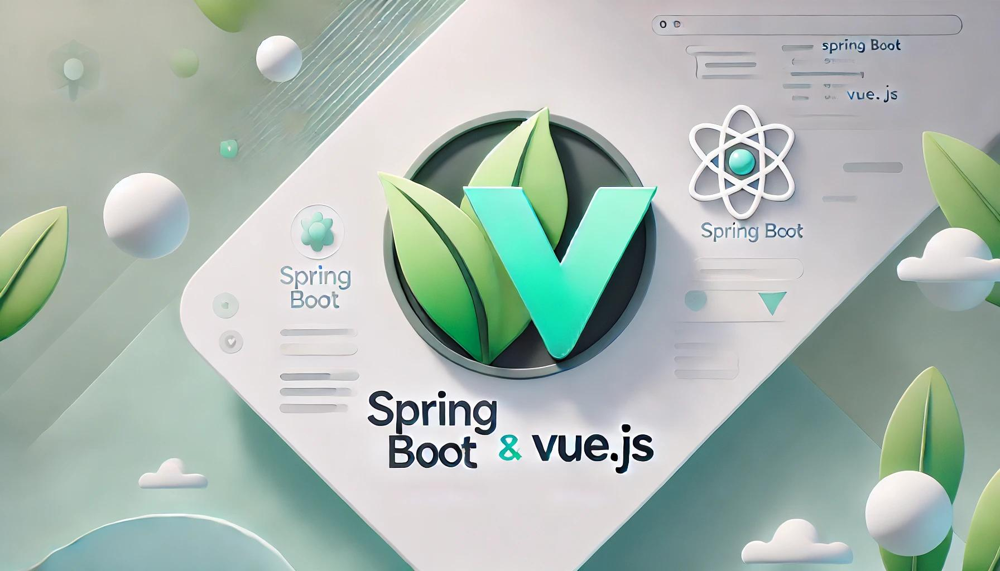

# Spring Java Blog Application & VueJS

[](https://github.com/spring-projects/spring-boot)
[](https://github.com/spring-projects/spring-boot)
[](https://vuejs.org/)

<div style="width: 50%; margin: auto;">
  
</div>


This project consists of a **Spring Boot** backend and a **VueJS** frontend, forming a full-stack blog application. It allows users to create, read, update, and delete blog posts, and also comment on each post.

---

## Table of Contents

- [Project Overview](#project-overview)
- [Technologies Used](#technologies-used)
- [Project Setup](#project-setup)
- [Running the Application](#running-the-application)
- [Configuration](#configuration)
- [Building the Application](#building-the-application)
- [Endpoints](#endpoints)
- [Testing](#testing)
- [Deployment](#deployment)
- [Flyway Migrations](#flyway-migrations)

---

## Project Overview

This Spring Boot application provides the backend API for managing blog posts and comments, while the VueJS frontend fetches data and displays it to the user.

### Example API Response:
Here’s an example response:

```json
[
  {
    "title": "Title 1",
    "content": "Content 1",
    "comments": [
      { "text": "comment 1" }
    ]
  },
  {
    "title": "Title 2",
    "content": "Content 2",
    "comments": [
      { "text": "comment 2" }
    ]
  },
  {
    "title": "Title 3",
    "content": "Content 3",
    "comments": [
      { "text": "comment 3" }
    ]
  }
]
```

## Project Setup

```
spring-blog-vuejs
├── backend            → Backend module with Spring Boot code
│   ├── src            → Source code for Spring Boot backend
│   ├── pom.xml        → Maven configuration for the backend module
│   └── application.yml → Spring Boot application configuration
├── frontend           → Frontend module with Vue.js and Vite
│   ├── src            → Source code for Vue.js frontend
│   │   ├── assets     → Static assets like images, fonts
│   │   ├── components → Vue components
│   │   ├── router     → Router configuration
│   │       └── index.ts → Main router config file
│   │   ├── views      → Vue views or pages
│   │   ├── App.vue    → Main Vue component
│   │   └── main.ts    → Vue.js entry point (Vite)
│   ├── public         → Public folder for static files
│   │   └── index.html → HTML template for the frontend
│   ├── test           → Unit tests and test-related files
│   │   ├── unit       → Component tests (with Vitest)
│   │   └── setup.ts   → Test setup file for Vitest
│   ├── package.json   → Node.js configuration for the frontend (Vue.js, Vite, Vitest)
│   ├── vite.config.ts → Vite configuration for the frontend
│   └── tsconfig.json  → TypeScript configuration for frontend
├── .env               → Environment variables for frontend (Vite)
├── .env.local         → Local environment variables for frontend (Vite)
└── pom.xml            → Parent Maven POM managing both backend and frontend modules
```

1. **Clone Repository**
   ```bash
   git clone https://github.com/daniellaera/spring-blog-app.git
   cd spring-blog-app
   ```

## Deployment Configuration

1. **Set Up Environment Variables**  
   Configure the following environment variables in your GitHub Actions workflow file (`.yml`), in the deployment service's settings, or in the repository's secrets section:

    - `DATABASE_URL`: The URL for your database connection (e.g., `jdbc:postgresql://<host>:<port>/<dbname>` for PostgreSQL).
    - `DATABASE_USERNAME`: The username for your database.
    - `DATABASE_PASSWORD`: The password for your database.

   ### Example for GitHub Actions
   You can set these environment variables as repository secrets in GitHub, and then reference them in your workflow file:

   ```yaml
   env:
     DATABASE_URL: ${{ secrets.DATABASE_URL }}
     DATABASE_USERNAME: ${{ secrets.DATABASE_USERNAME }}
     DATABASE_PASSWORD: ${{ secrets.DATABASE_PASSWORD }}

## Technologies Used

- **Java** and **Spring Boot** for backend development
- **PostgreSQL** as the relational database
- **Flyway** for database migrations
- **JUnit** and **Mockito** for unit and integration testing
- **GitHub Actions** for CI/CD pipeline

## Running the Application

1. **Run the application locally** with:
   ```bash
   ./mvnw spring-boot:run
   ```

2. **Run with the dev profile to load configuration from application-dev.yml** with:
   ```bash
   ./mvnw spring-boot:run -Dspring-boot.run.profiles=dev
   ```

3. **Access the application** at `http://localhost:8080`

## Configuration

The application settings are primarily managed through `application.yml` with environment-specific values for:
```yaml
spring:
  datasource:
    url: ${DATABASE_URL}
    username: ${DATABASE_USERNAME}
    password: ${DATABASE_PASSWORD}
    driver-class-name: org.postgresql.Driver
  jpa:
    hibernate:
      ddl-auto: none
  flyway:
    enabled: true
```

## Building the Application

To build the application and create an executable JAR file:
```bash
./mvnw clean package
```

## Endpoints

### Post Endpoints
- `GET /api/v3/post` - Retrieves all blog posts
- `GET /api/v3/post/{id}` - Retrieves a specific post by ID
- `POST /api/v3/post` - Create new post
- `DELETE /api/v3/post/{id}` - Delete a specific post by ID

### Comment Endpoints
- `GET /api/v3/{postId}/comments` - Retrieves all comments by postId
- `POST /api/v3/comment/{postId}` - Create new comment on specific postId
- `PATCH /api/v3/comment/{commentId}` - Update comment by ID

## Testing

Run tests with:
```bash
./mvnw test
```
The application includes unit tests for service layers and integration tests for the repository layer, ensuring data consistency and business logic reliability.

## Deployment

The application is configured to deploy using **Fly.io** via GitHub Actions. Ensure that the following GitHub Secrets are set for the deployment pipeline:
- `FLY_API_TOKEN`
- `DATABASE_URL`
- `DATABASE_USERNAME`
- `DATABASE_PASSWORD`

## Flyway Migrations
This SQL file, located in `src/main/resources/db/migration`, is processed by Flyway on startup if the database is missing this migration. It includes the initial table definitions and some sample data for testing:
`V1__init.sql`
```sql
-- Create post table
CREATE TABLE post (
    id SERIAL PRIMARY KEY,
    title VARCHAR(255),
    content TEXT
);

-- Create comment table with foreign key to post table
CREATE TABLE comment (
    id SERIAL PRIMARY KEY,
    text TEXT,
    post_id BIGINT,
    FOREIGN KEY (post_id) REFERENCES post(id)
);

-- Insert initial data into post table
INSERT INTO post (title, content)
VALUES ('Title 1', 'Content 1'),
       ('Title 2', 'Content 2'),
       ('Title 3', 'Content 3'),
       ('Title 4', 'Content 4');

-- Insert initial data into comment table
INSERT INTO comment (text, post_id)
VALUES ('comment 1', 1),
       ('comment 2', 2),
       ('comment 3', 3);
```

> *Tip: For safe versioning, avoid modifying applied migration files like `V1__init.sql`. Instead, create new migration files (e.g., `V2__add_column.sql`) for schema updates.*